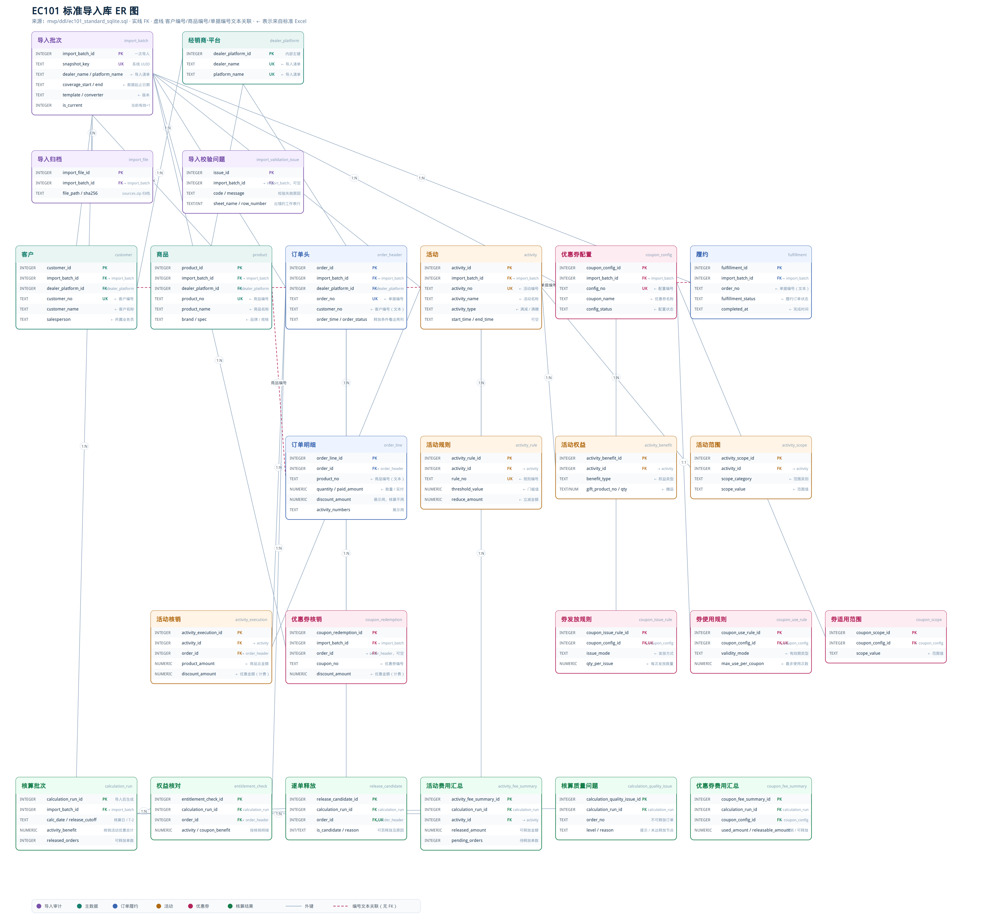
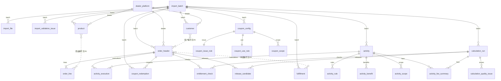

# 标准 Excel → `ec101_standard.db` 对照

导入入口：`mvp/import_service.py` 的 `import_snapshot`。一份标准工作簿一次写入一个 `import_batch`（导入批次），业务表都带这个批次号。导入只写业务事实。核算入口：`mvp/calculation_engine.py` 的 `calculate_batch`，另外写出核算表（不来自 Excel）。上传接口仍会在导入成功后自动调一次核算。

库文件：`mvp/ec101_standard.db`。DDL：`mvp/ddl/ec101_standard_sqlite.sql`。ER 图用 PNG 打开：[`docs/diagrams/ec101-standard-er.png`](diagrams/ec101-standard-er.png)（源文件是 SVG：`docs/diagrams/ec101-standard-er.svg`，用 `python3 scripts/build_standard_er_svg.py` 重画）。

快马验收实际转换出来的标准表（以前只在临时目录里、跑完就删）在 [`docs/samples/kuaima-verified-standard/`](samples/kuaima-verified-standard/README.md)：`满减/standard.xlsx`、`满赠/standard.xlsx`。当前库有哪些表、每张表多少行、一条样例，见同目录 [`ec101_standard库结构与当前数据.xlsx`](samples/kuaima-verified-standard/ec101_standard库结构与当前数据.xlsx)。重新生成：`python3 scripts/export_kuaima_verified_standard.py`。

## 1. 工作表落到哪张表

| 标准工作表 | 数据库表 | 一行 Excel 变成 |
|---|---|---|
| 导入清单（只有一行） | `import_batch` + `dealer_platform` | 一次导入的批次；经销商×平台若不存在则插入 |
| （校验失败时，当前接口以 HTTP 422 返回，表已建） | `import_validation_issue` | 字段问题：工作表、行号、列名、原因 |
| 标准客户 | `customer` | 一个客户一条 |
| 标准商品 | `product` | 一个商品一条 |
| 标准订单明细 | `order_header` + `order_line` | **同一单据编号只建一条订单头**，每个商品行一条明细 |
| 标准活动 | `activity` | 一个活动一条 |
| 标准活动规则 | `activity_rule` | 用活动编号找到 `activity_id` 后插入 |
| 标准活动权益 | `activity_benefit` | 同上 |
| 标准活动范围 | `activity_scope` | 同上 |
| 标准活动核销明细 | `activity_execution` | 活动编号→`activity_id`，订单号→`order_id` |
| 标准优惠券配置 | `coupon_config` | 一个配置一条 |
| 标准优惠券发放规则 | `coupon_issue_rule` | 配置编号→`coupon_config_id` |
| 标准优惠券使用规则 | `coupon_use_rule` | 同上 |
| 标准优惠券适用范围 | `coupon_scope` | 同上 |
| 标准优惠券核销明细 | `coupon_redemption` | 订单号能匹配则填 `order_id`，否则为空 |
| 标准履约 | `fulfillment` | 按单据编号文本保存，**没有**订单外键 |
| （导入后计算，无工作表） | `calculation_run`、`entitlement_check`、`release_candidate`、`activity_fee_summary`、`calculation_quality_issue` | 按核销明细核算 |

校验（写入前）：订单上的客户编号/商品编号必须出现在本文件的客户表/商品表；活动核销的活动编号、订单号必须存在；券核销若填了订单号也必须存在。见 `validate_import`。

## 2. 字段对照

系统自己生成的列（主键、`import_batch_id`、`dealer_platform_id`）不在 Excel 里，表中标「系统生成」。

### 导入清单 → `import_batch` / `dealer_platform`

| 标准列 | 表.字段 | 说明 |
|---|---|---|
| 经销商名称 | `import_batch.dealer_name`、`dealer_platform.dealer_name` | 同时用于查找/创建经销商平台 |
| 平台名称 | `import_batch.platform_name`、`dealer_platform.platform_name` | 同上；唯一键 (经销商, 平台) |
| 数据开始日期 | `import_batch.coverage_start` | 空则 NULL |
| 数据结束日期 | `import_batch.coverage_end` | 空则 NULL |
| 模板版本 | `import_batch.template_version` | |
| 转换工具版本 | `import_batch.converter_version` | |
| 生成时间 | （不入库） | 仅留在 Excel |
| — | `import_batch.snapshot_key` | 系统生成 UUID |
| — | `import_batch.imported_at` | 导入时刻 |
| — | `import_batch.status` | 导入成功 `imported`，核算完 `calculated` |
| — | `import_batch.is_current` | 同一经销商+平台+数据期间再导一次，旧批改为 0，新批为 1 |

### 标准客户 → `customer`

| 标准列 | 字段 |
|---|---|
| 客户编号 | `customer_no`（批次内唯一） |
| 客户名称 | `customer_name` |
| 客户类型 | `customer_type` |
| 客户区域 | `customer_region` |
| 详细地址 | `address` |
| 联系电话 | `phone` |
| 添加时间 | `added_at` |
| 所属业务员 | `salesperson` |

### 标准商品 → `product`

| 标准列 | 字段 |
|---|---|
| 商品编号 | `product_no`（批次内唯一） |
| 商品名称 | `product_name` |
| 商品品牌 | `brand` |
| 商品目录 | `category` |
| 商品条码 | `barcode` |
| 商品规格 | `spec` |
| 基本单位 | `base_unit` |
| 箱规 | `box_conversion` |
| 每箱基本单位数量 | `base_qty_per_box`（转数字，失败为 0） |

### 标准订单明细 → `order_header`（每个单据编号第一次出现时）

| 标准列 | 字段 |
|---|---|
| 单据编号 | `order_no`（批次内唯一） |
| 下单时间 | `order_time` |
| 客户编号 | `customer_no`（文本，**不是** `customer.customer_id`） |
| 客户名称 | `customer_name` |
| 业务员 | `salesperson` |
| 订单来源 | `order_source` |
| 订单类型 | `order_type` |
| 订单状态 | `order_status` |
| 支付方式 | `payment_method` |
| 下游订单编号 | `downstream_order_no` |

同一订单后续商品行不再改订单头（沿用第一次出现的状态/时间）。

### 标准订单明细 → `order_line`（每一行）

| 标准列 | 字段 |
|---|---|
| （系统） | `order_id` ← 上面建成的订单头 |
| 商品编号 | `product_no`（文本，**不是** `product.product_id`） |
| 商品名称 | `product_name` |
| 商品目录 | `category` |
| 规格 | `spec` |
| 商品条码 | `barcode` |
| 单位 | `unit` |
| 数量 | `quantity` |
| 优惠前金额 | `pre_discount_amount` |
| 活动编号 | `activity_numbers`（展示用，核算不用） |
| 优惠券编号 | `coupon_numbers`（展示用，核算不用） |
| 优惠金额 | `discount_amount`（平台全部优惠合计，核算不用） |
| 实付金额 | `paid_amount` |
| 单价 | `unit_price` |
| 退货数量 | `return_qty` |

### 标准活动 → `activity`

| 标准列 | 字段 |
|---|---|
| 活动编号 | `activity_no`（批次内唯一） |
| 活动名称 | `activity_name` |
| 活动类型 | `activity_type` |
| 促销方式 | `promo_method`（空则 NULL） |
| 开始时间 | `start_time`（空则 NULL） |
| 结束时间 | `end_time`（空则 NULL） |
| 是否允许叠加活动 | `allow_activity_stack` |
| 是否允许叠加优惠券 | `allow_coupon_stack` |
| 活动状态 | `activity_status` |

快马当前只填编号、名称、类型（从活动明细政策文本解析）。

### 标准活动规则 / 权益 / 范围

| 工作表 | 标准列 | 表.字段 |
|---|---|---|
| 规则 | 活动编号 | → `activity_id` |
| 规则 | 规则编号 | `activity_rule.rule_no` |
| 规则 | 门槛类型 / 门槛值 / 立减金额 | `threshold_type` / `threshold_value` / `reduce_amount` |
| 规则 | 是否免邮 | `free_shipping`：值为 `1`/`是`/`true` 则为 1，否则 0 |
| 权益 | 活动编号 | → `activity_id` |
| 权益 | 规则编号、权益编号、权益类型 | `rule_no`、`benefit_no`、`benefit_type` |
| 权益 | 赠品商品编号/名称/数量/单位 | `gift_product_no` 等 |
| 范围 | 活动编号 | → `activity_id` |
| 范围 | 范围编号/类别/维度/值 | `scope_no` 等 |

### 标准活动核销明细 → `activity_execution`（费用来源之一）

| 标准列 | 字段 |
|---|---|
| 活动编号 | → `activity_id` |
| 订单号 | → `order_id`（必须已有订单头） |
| 活动名称 | `activity_name` |
| 客户编号 | `customer_no` |
| 客户 | `customer_name` |
| 所属业务员 | `salesperson` |
| 商品总金额 | `product_amount` |
| 优惠金额 | `discount_amount`（核算用这个数） |

同一活动+同一订单只能一条（表上 UNIQUE）。

### 优惠券配置及规则

| 工作表 | 标准列 | 表.字段 |
|---|---|---|
| 配置 | 优惠券配置编号 | `coupon_config.config_no` |
| 配置 | 优惠券名称 / 券类型 / 配置状态 | `coupon_name` / `coupon_type` / `config_status` |
| 发放规则 | 优惠券配置编号 | → `coupon_config_id` |
| 发放规则 | 发放方式、开始/结束/自动发放时间 | `issue_mode`、`issue_start_at`、`issue_end_at`、`auto_issue_at` |
| 发放规则 | 每次发放数量、每客户领取上限、每日领取上限、规则状态 | `qty_per_issue` 等 |
| 使用规则 | 券类型、有效期类型、使用起止、领取后有效天数、每张券最多使用次数、规则状态 | `coupon_use_rule` 对应列 |
| 适用范围 | 范围编号/类别/维度/值 | `coupon_scope` |

### 标准优惠券核销明细 → `coupon_redemption`（费用来源之二）

| 标准列 | 字段 |
|---|---|
| 优惠券编号 | `coupon_no` |
| 客户编号 | `customer_no` |
| 客户 | `customer_name` |
| 所属业务员 | `salesperson` |
| 领取时间 | `receive_time` |
| 使用期限 | `use_period` |
| 状态 | `status` |
| 使用时间 | `used_at` |
| 订单号 | → `order_id`（找不到则为 NULL） |
| 优惠金额 | `discount_amount`（核算用这个数） |

### 标准履约 → `fulfillment`

| 标准列 | 字段 |
|---|---|
| 单据编号 | `order_no`（文本，不连 `order_header.order_id`） |
| 下游订单编号 | `downstream_order_no` |
| 履约订单状态 | `fulfillment_status` |
| 出库时间 | `outbound_at` |
| 完成时间 | `completed_at` |
| 结款状态 | `settlement_status` |
| 退货数量 | `return_qty` |

当前释放规则看的是 **订单头的订单状态和下单时间**，不读履约表。

快马源文件如何变成这些标准表、导入后如何核算，见 [`快马转换与核算逻辑.md`](快马转换与核算逻辑.md)。

## 3. 导入之后才生成的表（RESULT）

不对应任何标准工作表。数据来自本批次的订单头 + 活动核销 + 券核销。计算步骤见 [`快马转换与核算逻辑.md`](快马转换与核算逻辑.md) 第 3 节。

| 表 | 一行是什么 |
|---|---|
| `calculation_run` | 这一批导入的一次核算：核算日、T-2 截止、核销合计、可释放合计 |
| `entitlement_check` | 每张参与订单的活动优惠+券优惠（consistency 固定为「按核销明细」） |
| `release_candidate` | 同一张参与订单是否可释放及原因 |
| `activity_fee_summary` | 每个活动的参与/可释放/待释放单数和金额 |
| `calculation_quality_issue` | 不可释放订单：类型「未达释放节点」、级别「提示」 |

可释放条件：`order_status = 已完成` 且 `order_time` 早于核算日前 2 天的 00:00:00。

## 4. 编号对上、但没有外键的地方

这些在 Excel 里是同一个编号，库里也按文本保存，**没有** `REFERENCES`：

- `order_header.customer_no` ↔ `customer.customer_no`（同一 `import_batch_id`）
- `order_line.product_no` ↔ `product.product_no`
- `fulfillment.order_no` ↔ `order_header.order_no`

有外键、导入时已经换成内部 ID 的：

- 订单行 → 订单头
- 活动规则/权益/范围/核销 → 活动
- 活动核销 → 订单头
- 券规则/范围 → 券配置
- 券核销 → 订单头（可选）
- 核算表 → 导入批次 / 订单 / 活动

## 5. 关系总览（GitHub 可渲染）

实线在库里是外键；`客户编号` / `商品编号` / `单据编号` 只按文本对齐，没有 `REFERENCES`。

